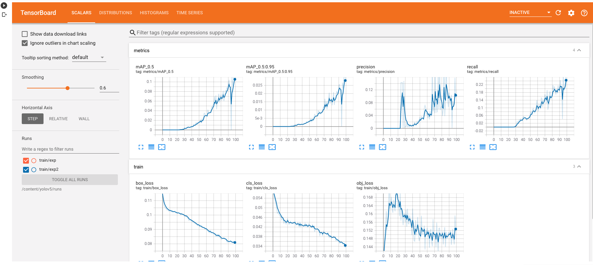

# Custom Object Detection With YoloV5

This repository contains a notebook to train your own custom object detector using YOLOv5. I have used the code of [Ultralytics](https://github.com/ultralytics/yolov5) to train the model. Make sure to check their repository also. It's great.

I have posted a detailed tutorial in medium. Here's the link:

- [Medium](https://thecaffeinedev.medium.com/training-a-custom-object-detection-model-with-yolo-v5-aa9974c07088) 

### Training:

### Tensorboard results :

If you have any questions, recommendations or critiques, I can be reached via [Twitter](https://twitter.com/thecaffeinedev) or via my [mail](mailto:thedlmonk@gmail.com). Feel free to reach out to me.
